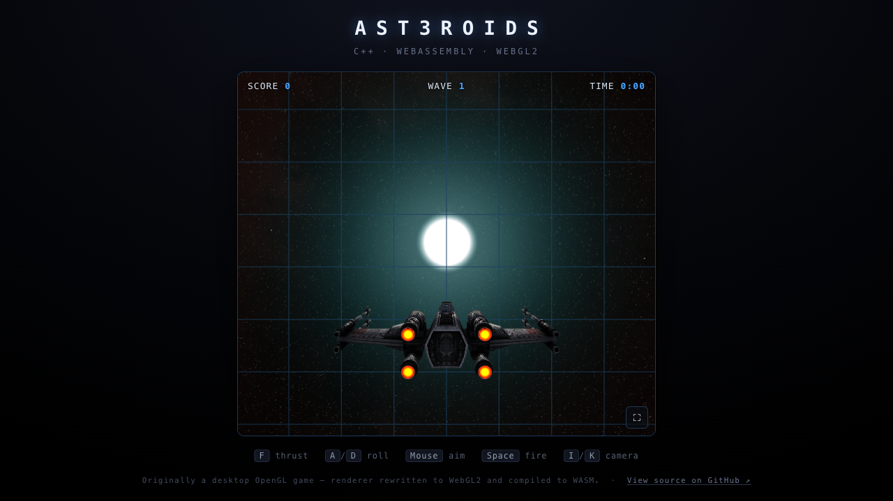

# AST3ROIDS

A 3D arcade shooter with a *Star Fox* feel: fly an X-Wing through a walled arena,
blast asteroids that split as you hit them, and survive escalating waves.

**▶ Play it in your browser: https://karlrombauts.github.io/Ast3roids/**



It began life as a desktop OpenGL game (fixed-function pipeline + GLUT). The
renderer was then rewritten from scratch as a modern shader-based GLES3 / WebGL2
pipeline and compiled to WebAssembly with Emscripten, so the whole game runs in
the browser while still building natively.

## Features

- **Entity–Component–System** core — gameplay, physics, rendering and effects are
  all independent systems over a shared component store.
- **Hand-written renderer** — VBO/VAO meshes, GLSL shaders, per-fragment Phong
  lighting, normal and specular mapping, and a custom column-major matrix /
  quaternion math library.
- **Effects** — camera-facing billboards with sprite-sheet animation (explosions,
  bullet-impact sparks, engine glow), additive blending, and a distance-faded grid.
- **Procedural asteroids** — UV-sphere geometry distorted with layered noise and
  welded normals for a seamless, almost-matte rock.
- **One codebase, two targets** — the same C++ builds to a native SDL2 desktop app
  and to WASM + WebGL2 for the web.

## Controls

| Input | Action |
| --- | --- |
| `F` | Thrust |
| `A` / `D` | Roll |
| Mouse | Aim |
| `Space` | Fire |
| `I` / `K` | Camera distance |

On a phone (landscape): **aim the phone** to steer (look where you want to fly), **tilt** to roll, **tap/hold** to shoot, **slide** to zoom — the ship auto-thrusts. Add it to your home screen to play fullscreen.

## Tech stack

C++17 · CMake · SDL2 · OpenGL / GLES3 · WebGL2 · Emscripten · GoogleTest

## Building

### Native (desktop)

```sh
cmake -S . -B build
cmake --build build --target StarFox_run
./build/src/StarFox_run
```

### Web (WebAssembly)

Requires the [Emscripten SDK](https://emscripten.org/) on your `PATH`.

```sh
emcmake cmake -S . -B build-web
cmake --build build-web --target StarFox_run
# serve build-web/src and open StarFox_run.html
```

### Tests

```sh
cmake --build build --target StarFox_test && ./build/tests/StarFox_test
```
